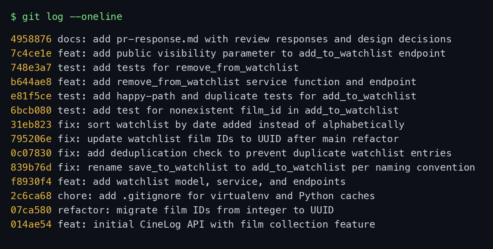

# PR Response Doc — CineLog Watchlist Feature

This document walks through each of the six review comments from `@dev-lead`,
what I changed, and why. Comments 4 and 5 are design decisions, so those
sections are longer — they argue a position rather than just describe a fix.

## AI Usage

I used AI (Claude) in a few specific, bounded ways:

- **Orientation.** Before reading the review, I had it summarize `models.py`,
  `services/collection_service.py`, and `tests/test_collection.py` so I understood
  the existing patterns first. I verified every summary against the actual code —
  the one thing it got wrong initially was claiming `WatchlistEntry` had a `film`
  relationship; the code didn't, which is a bug I ended up fixing (see Comment 1's
  section).
- **Pattern check for Comment 2.** I asked it to explain what `add_to_collection()`
  returns when a duplicate is detected, then wrote my own dedup check to match. I
  did not have it write the dedup code.
- **Commit-format hygiene.** I pasted my `git log --oneline` and asked whether the
  messages followed Conventional Commits and whether any commit bundled more than
  one logical change, then checked its answer against the spec myself.
- **Devil's advocate on Comments 4 and 5.** After drafting both design responses, I
  asked "what would a careful reviewer push back on here, and what tradeoff am I not
  acknowledging?" For Comment 4 it pushed on the privacy-surprise angle, which made
  me add the explicit note that a watchlist holds *intent*, not *history*, so the
  cost of accidental exposure is lower than it would be for the collection — and to
  lean on the schema asymmetry as the real justification. For Comment 5 it raised
  the "alphabetical is better for lookup in a long list" counterpoint, which is why
  my final answer proposes an opt-in `?sort=title` param instead of treating it as
  either/or. The positions themselves are mine and are grounded in how CineLog's two
  lists are actually modeled.

---

## Comment 1 — Rename

> `save_to_watchlist()` should follow the project's naming convention. Compare with
> `add_to_collection()` — the pattern here is `verb_to_noun`. Please rename to
> `add_to_watchlist()` and update all call sites.

**What I did:** Renamed the function to `add_to_watchlist()` in
`services/watchlist_service.py` and updated its call site.

**How I found every call site:** I ran `git grep -n "save_to_watchlist"` across the
whole tree rather than trusting a single-file search. That returned exactly three
hits: the definition in `services/watchlist_service.py`, and two references in
`routes/watchlist/watchlist.py` (the `import` line and the call inside `add_film`).
After renaming I re-ran the grep — zero hits for the old name — and ran the full
test suite to confirm nothing imported the old symbol. `CONTRIBUTING.md` documents
the `verb_to_noun` pattern (`add_to_collection`, `remove_from_collection`,
`get_collection`), so `add_to_watchlist` lines up with the rest of the service layer.

---

## Comment 2 — Deduplication

> What happens if a user calls this with a film that's already on their watchlist?
> The current implementation would add a duplicate entry. Please handle this case.

**What I did:** Added a deduplication check to `add_to_watchlist()` modeled directly
on `add_to_collection()`.

**How it works (and what I copied from `add_to_collection`):** `add_to_collection()`
does two guards before inserting — it looks the film up and raises `FilmNotFoundError`
if it doesn't exist, then queries for an existing `(user_id, film_id)` row and raises
`AlreadyInCollectionError` if one is found. I mirrored the second guard: before
creating the entry, I query
`WatchlistEntry.query.filter_by(user_id=user_id, film_id=film_id).first()` and, if a
row comes back, raise a new `AlreadyInWatchlistError`. So a repeated add now returns
`409 Conflict` (handled in the route) instead of silently inserting a second row.

I also added a `UniqueConstraint("user_id", "film_id")` to `WatchlistEntry`, because
`CollectionEntry` has the same constraint as a database-level backstop against races.
The application check gives a clean error message; the constraint guarantees the
invariant even if two requests slip through at once.

**How I verified:** A script that adds the same film twice raised
`AlreadyInWatchlistError` and left exactly one row, and the end-to-end curl run
returned `409` on the second POST. This is also pinned by
`test_add_to_watchlist_duplicate_raises`.

---

## Comment 3 — Missing test

> Please add a test for the case where `film_id` doesn't exist in the database. Look
> at the existing tests in `test_collection.py` — the pattern is there.

**What I did:** Created `tests/test_watchlist.py` and added
`test_add_to_watchlist_nonexistent_film_raises`.

**What it checks and what I modeled it on:** I copied the structure of
`test_add_to_collection_nonexistent_film_raises` — same `app` / `sample_user`
fixtures, same in-memory SQLite setup. The test calls `add_to_watchlist` with a
UUID that was never inserted (`"00000000-0000-0000-0000-000000000000"`) and asserts
it raises `FilmNotFoundError`, i.e. the service rejects the bad ID cleanly instead of
failing on a foreign-key error at commit time.

**How I verified:** `pytest tests/test_watchlist.py -v` — passes. Full suite is green
(4 collection + 6 watchlist tests).

---

## Comment 4 — Default visibility

> I notice watchlists default to `public=True`. We don't have a documented decision
> on default visibility for user lists. Before I can approve this, I need you to add
> a note explaining your reasoning.

**My position:** Keep the default `public=True`.

**Reasoning (specific to CineLog):** The strongest argument isn't a generic "public
is good for discovery" — it's that CineLog's own data model already draws the line
for us. Look at the two entry models: `CollectionEntry` (films a user has *watched*)
has `id`, `user_id`, `film_id`, `date_added`, `rating` — and **no visibility field at
all**. `WatchlistEntry` (films a user *wants to watch*) is the only one of the two
that carries a `public` column. Whoever designed the schema treated the collection as
private-by-omission and the watchlist as the shareable surface. Defaulting the
watchlist to public is following that intent, not inheriting an accident.

That lines up with what a watchlist actually is on a community film app. A watchlist
is *forward-looking intent* — "films I'm planning to see" — which is exactly the kind
of thing people are happy to broadcast and which starts conversations ("you added
*Arrival* too — tell me what you think"). It's the natural discovery surface:
browsing a friend's watchlist is how you find your next film. And defaults are
sticky — most users never open settings — so on an app whose whole pitch is
"community film tracking," a private default would leave the majority of watchlists
invisible and quietly starve the social features that differentiate CineLog from a
private notes app.

**Tradeoff acknowledged:** The alternative, private-by-default, optimizes for privacy
and least surprise — a user who doesn't read the fine print might not realize their
list is visible, and "share by default" has burned products before. That's a real
cost and I'm not hand-waving it. Two things make it acceptable here: (1) the watchlist
holds *intent, not history* — leaking "I want to watch X" is far lower-stakes than
leaking a full viewing record, which is precisely why it's fine for the watchlist to
default open while the collection stays closed; and (2) visibility is per-entry and,
after my stretch change, settable at add time, so a privacy-conscious user has
granular control without a global toggle. I'd revisit this if usage data showed
people treat the watchlist as a private "reminder to self" — but absent that signal,
the community mission and the schema both point to public.

---

## Comment 5 — Sort order

> I'd prefer watchlists to default to "date added" order rather than alphabetical.
> Most users want to see what they added recently. I'm open to discussion if you see
> it differently — but let's make a decision and document it.

**My position:** Agree — I switched the default to date added, newest first
(`WatchlistEntry.date_added.desc()`), and implemented it in `get_watchlist()`.

**Reasoning (specific to CineLog):** There's a consistency argument the comment
doesn't mention, and I think it's the decisive one. `get_collection()` *already*
returns entries `date_added.desc()` — newest first. The watchlist was the odd one out,
sorting `Film.title.asc()`. Two sibling lists in the same app that sort by different
rules is exactly the kind of small inconsistency users feel without being able to name
it. So this isn't just "the reviewer prefers recency" — recency is already the
house style for the collection, and the watchlist should match it.

On behavior: a watchlist is a queue of intent that people fill in bursts — you add a
film right after a friend recommends it or a trailer drops. The dominant question a
user brings to their watchlist is "what did I just add / what do I want to watch
tonight," and recency answers that directly. Alphabetical order mainly helps a
different task — *looking up* whether a specific title is already on the list — which
only matters once a list is long.

**Engagement with the reviewer's point:** I agree with "most users want to see what
they added recently," and I'd strengthen it with the `get_collection` precedent above.
The honest counterpoint is that alphabetical is genuinely better for scanning a long
list for one title. My synthesis: that's a *search/lookup* need, not a default-sort
need. If watchlists grow large enough that lookup becomes common, the right answer is
an optional `?sort=title` query param on `GET /watchlist/<user_id>`, so recency stays
the default and alphabetical becomes opt-in. That keeps the decision extensible
instead of forcing an either/or, and it means we don't trade the everyday "what's
new" experience for an occasional lookup.

---

## Comment 6 — Rebase

> A refactor merged to `main` that changed film IDs from integers to UUIDs. Your
> watchlist code still references integer IDs. Please rebase on `main` and update
> accordingly.

**What conflicted:** I rebased `feature/watchlist` onto the updated `main`
(`git rebase origin/main`). The interesting part: git reported the rebase as
*successful with no textual conflict*, but the result was wrong. The refactor commit
on `main` had **deleted** the `WatchlistEntry` model (it doesn't exist on `main` yet)
and migrated `Film.id` and `CollectionEntry.film_id` from `Integer` to
`String(36)`/UUID. Because my feature branch never *modified* those exact lines,
git silently accepted `main`'s deletion — so after the "clean" rebase my
`WatchlistEntry` model had vanished and the watchlist service/route were still written
around integer film IDs. This was the real lesson of the exercise: a green rebase is
not the same as a correct one, so I always re-run the tests / boot the app afterward.

**How I resolved it:** I rebuilt the branch cleanly on top of the UUID `main` and
brought the watchlist code in line with the new ID type:

- Re-added the `WatchlistEntry` model, then changed its `film_id` from
  `db.Integer` to `db.String(36)` so it matches `Film.id` and
  `CollectionEntry.film_id` (commit `fix: update watchlist film IDs to UUID after
  main refactor`).
- Updated the service docstring (`film_id (int)` → `film_id (str): UUID`) and the
  route body doc (`{ "film_id": <int> }` → `{ "film_id": "<uuid>" }`).
- While re-adding the model I also gave `Film`/`User` the `watchlist_entries`
  relationship the original code was missing, so `get_watchlist()`'s use of
  `entry.film` actually works (it would have thrown before).

The branch is rebased onto `main`, not merged — the history is linear with **zero
merge commits** (`git rev-list --merges origin/main..HEAD` returns nothing).

**How I verified no conflict remains:** `git grep "db.Integer"` shows no `film_id`
still typed as integer; `create_app()` boots against a fresh UUID database; the full
pytest suite passes; and the end-to-end curl run works with real UUID film IDs.

---

## Stretch features

- **`remove_from_watchlist(user_id, film_id)`** — Follows the `remove_from_collection`
  pattern: it looks up the `(user_id, film_id)` row and raises a new
  `NotInWatchlistError` (surfaced as `404`) when the film isn't on the list, otherwise
  deletes it and returns `True`. Exposed as `DELETE /watchlist/<user_id>/remove`.
  Covered by `test_remove_from_watchlist_deletes_entry` and
  `test_remove_from_watchlist_not_in_list_raises`.
- **Second test (my choice of edge case)** — `test_add_to_watchlist_duplicate_raises`.
  The review only asked for the nonexistent-film case (Comment 3). I chose the
  duplicate-add case because it's the one that pins the deduplication logic I added
  for Comment 2 — without it, that branch of `add_to_watchlist` had no regression
  coverage. It asserts the second add raises `AlreadyInWatchlistError` and that
  exactly one row remains.
- **Visibility toggle** — `add_to_watchlist()` now takes an optional `public=True`
  argument, and `POST /watchlist/<user_id>/add` reads `"public"` from the request body
  (`data.get("public", True)`). The default is unchanged (public — see Comment 4), so
  existing callers behave the same, but a caller can now send
  `{"film_id": "...", "public": false}` to create a private entry explicitly.
  `test_add_to_watchlist_respects_public_flag` confirms `public=False` is stored.

---

## Commit history

Linear, Conventional Commits, one logical change each, no merge commits:

```
4958876 docs: add pr-response.md with review responses and design decisions
7c4ce1e feat: add public visibility parameter to add_to_watchlist endpoint
748e3a7 test: add tests for remove_from_watchlist
b644ae8 feat: add remove_from_watchlist service function and endpoint
e81f5ce test: add happy-path and duplicate tests for add_to_watchlist
6bcb080 test: add test for nonexistent film_id in add_to_watchlist
31eb823 fix: sort watchlist by date added instead of alphabetically
795206e fix: update watchlist film IDs to UUID after main refactor
0c07830 fix: add deduplication check to prevent duplicate watchlist entries
839b76d fix: rename save_to_watchlist to add_to_watchlist per naming convention
f8930f4 feat: add watchlist model, service, and endpoints
2c6ca68 chore: add .gitignore for virtualenv and Python caches
07ca580 refactor: migrate film IDs from integer to UUID   ← main (rebased onto)
014ae54 feat: initial CineLog API with film collection feature
```



> The `docs:` commit's own short hash shifts when this file is finalized (a commit
> can't embed its own final hash); everything below it is stable. The point stands:
> linear history, Conventional Commits, no merge commits.

---

## PR Description

### What this feature does

Adds a **watchlist** to CineLog — the list of films a user *wants to watch*, separate
from the collection (films they've already watched). A `WatchlistEntry` model backs
three REST endpoints:

- `GET /watchlist/<user_id>` — the user's watchlist, newest additions first.
- `POST /watchlist/<user_id>/add` — add a film (`{"film_id": "<uuid>"}`, optional
  `"public"`). Returns `201`, or `404` if the film doesn't exist, or `409` if it's
  already on the list.
- `DELETE /watchlist/<user_id>/remove` — remove a film (`{"film_id": "<uuid>"}`).
  Returns `200`, or `404` if it isn't on the list.

### Design decisions

- **Default visibility: public.** New watchlist entries default to `public=True`.
  CineLog is a community app and the schema only gives the *watchlist* (not the
  collection) a visibility field, so the watchlist is the intended shareable surface;
  a watchlist is forward-looking intent, which is low-stakes to share and drives
  discovery. Callers can override per entry with `"public": false`. (Full argument:
  Comment 4.)
- **Default sort: date added, newest first.** Matches `get_collection()` so the two
  lists behave consistently, and recency is what users want when they open a
  watchlist. Alphabetical would be added later as an opt-in `?sort=title`, not the
  default. (Full argument: Comment 5.)

### How to test it manually

The films/users tables are seed-only (no create endpoints), so first seed a user and a
couple of films, then exercise the endpoints. From the repo root:

```bash
python -m venv .venv && source .venv/bin/activate
pip install -r requirements.txt

# 1. Seed a user + two films and print their UUIDs
python - <<'PY'
from app import create_app, db
from models import User, Film
app = create_app()
with app.app_context():
    u = User(username="molly", email="molly@example.com")
    f1 = Film(title="Paddington 2", year=2017, genre="Comedy")
    f2 = Film(title="Arrival", year=2016, genre="Sci-Fi")
    db.session.add_all([u, f1, f2]); db.session.commit()
    print("USER_ID =", u.id); print("FILM1 =", f1.id); print("FILM2 =", f2.id)
PY

# 2. Start the app (in another terminal)
python app.py     # serves at http://127.0.0.1:5000

# 3. Drive the endpoints (paste in the UUIDs from step 1)
BASE=http://127.0.0.1:5000
curl -X POST  $BASE/watchlist/$USER_ID/add    -H 'Content-Type: application/json' -d "{\"film_id\":\"$FILM1\"}"            # 201
curl -X POST  $BASE/watchlist/$USER_ID/add    -H 'Content-Type: application/json' -d "{\"film_id\":\"$FILM1\"}"            # 409 duplicate
curl -X POST  $BASE/watchlist/$USER_ID/add    -H 'Content-Type: application/json' -d "{\"film_id\":\"$FILM2\"}"            # 201
curl          $BASE/watchlist/$USER_ID                                                                                     # FILM2 first (newest)
curl -X POST  $BASE/watchlist/$USER_ID/add    -H 'Content-Type: application/json' -d '{"film_id":"00000000-0000-0000-0000-000000000000"}'  # 404
curl -X DELETE $BASE/watchlist/$USER_ID/remove -H 'Content-Type: application/json' -d "{\"film_id\":\"$FILM1\"}"           # 200
curl -X DELETE $BASE/watchlist/$USER_ID/remove -H 'Content-Type: application/json' -d "{\"film_id\":\"$FILM1\"}"           # 404 not on list
```

Or just run the automated suite, which covers the same behavior:

```bash
pytest tests/ -v
```
